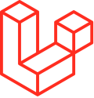
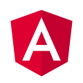

# Teste Fullstack Novakio

## Tecnologias
<table>
    <tr>
        <td>
            
        </td>
        <td>
            
        </td>
        <td>
            
        </td>
        <td>
            
        </td>
    </tr>
</table> 

## Requirements
You need to have PHP version **8.0** or above. Node.js version **12.0** or above.

## Demo
https://yoursurveys.xyz

## Installation

#### Backend
1. Clone the project
2. Go to the project root directory
3. Run `composer install`
4. Create database
5. Copy `.env.example` into `.env` file and adjust parameters
6. Run `php artisan serve` to start the project at http://localhost:8000

#### Frontend
1. Navigate to `vue` folder using terminal
2. Run `npm install` to install vue.js project dependencies
3. Copy `vue/.env.example` into `vue/.env` and specify API URL
4. Start frontend by running `npm run dev`
5. Open http://localhost:3000

## License

The Laravel framework is open-sourced software licensed under the [MIT license](https://opensource.org/licenses/MIT).

